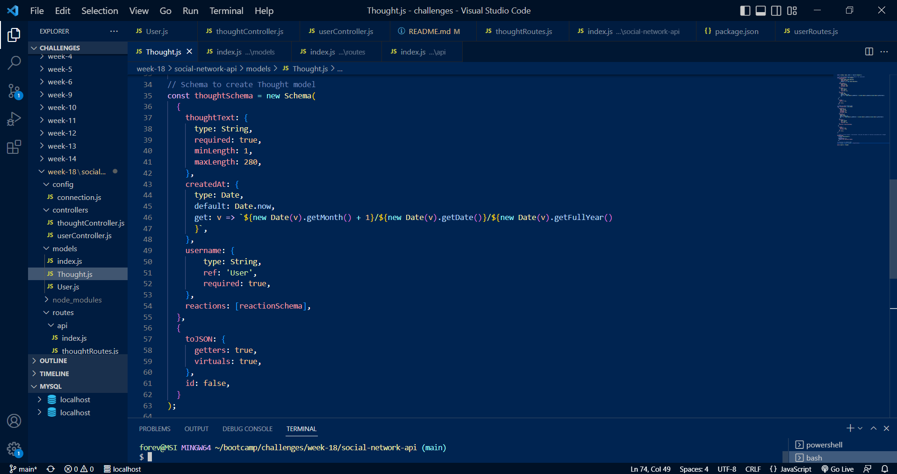

# Week 18: Social Network API

## Description

This repository is where I create code for a social network API with thought and user routes.

## Installation

N/A

## Usage

Run node.js to initiate the social network database. You can view and edit Users and Thoughts in the database by using the relevant api route and paramaters in Insomnia. Users can be added to and removed from a friends list, and reactions added to and removed from Thoughts, with the applicable POST and DELETE routes in Insomnia.

Link to walkthrough video: (#)

## Credits

The following resources were referenced to ensure best practice and adherence to appropriate conventions:

Express.js Installation: (https://www.npmjs.com/package/express)

Mongoose Installation: (https://www.npmjs.com/package/mongoose)

Mongoose Documentation: (https://mongoosejs.com/docs/schematypes.html#objectids)

Mongo DB Documentation: (https://www.mongodb.com/docs/manual/core/databases-and-collections/)

Common js functions and parameters, for loops and arrays: JS CheatSheet by HTML CheatSheet (https://htmlcheatsheet.com/js/)

## License

Licensed under the standard MIT license. Please refer to the license in the repo for more information.
